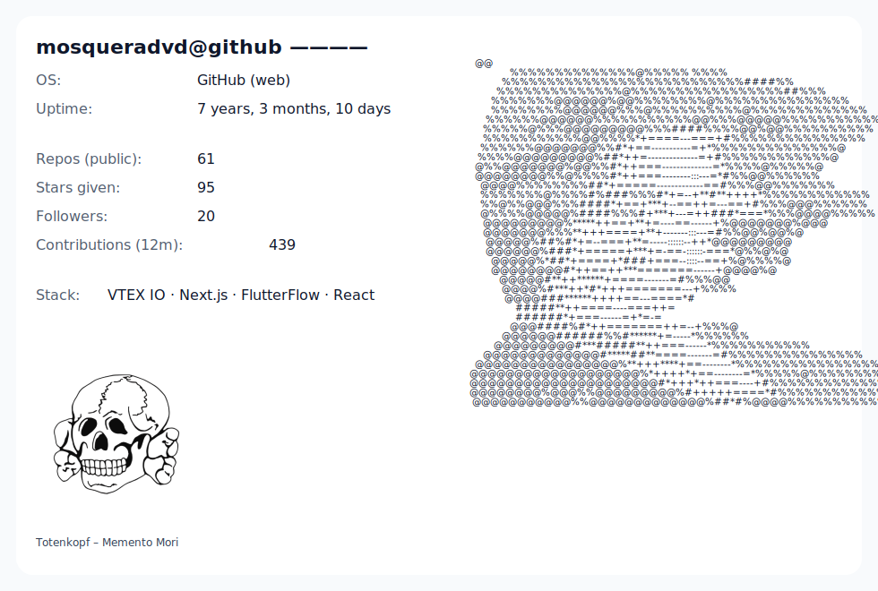

 
 

Software Engineer with a foundation in Systems Engineering. ***Specialized in the VTEX IO/FastStore, FlutterFlow, and Next.js ecosystems***. With over 4+ years of experience implementing e-commerce solutions for LATAM/USA. I improve performance and time-to-market through modular architecture and automation with N8N and Make. I have led implementations, created custom applications, and mentored teams to accelerate the adoption of VTEX IO. ***See my contributions.***

***I have also worked in the occupational Health and Safety Sector (OHS)***, creating applications that help optimize treatment, maintenance traceability, and asset management within companies, ensuring compliance with standards such as ISO 45001. ***See the case study.***

I know how to audit the internal processes of technology companies so that they can be certified according to the *ISO 27001 standard*, due to my recent experience as CISO.

I enjoy constantly learning, and as part of my desire to do so, I am immersed in a journey to delve into the world of cloud computing with training in AWS Cloud Practitioner.

 

### Skills

      
      
      
         <!--
      
      
    -->

 
      
<picture>
  <source media="(prefers-color-scheme: dark)" srcset="assets/card_dark.svg">
  <source media="(prefers-color-scheme: light)" srcset="assets/card_light.svg">
  
</picture>
